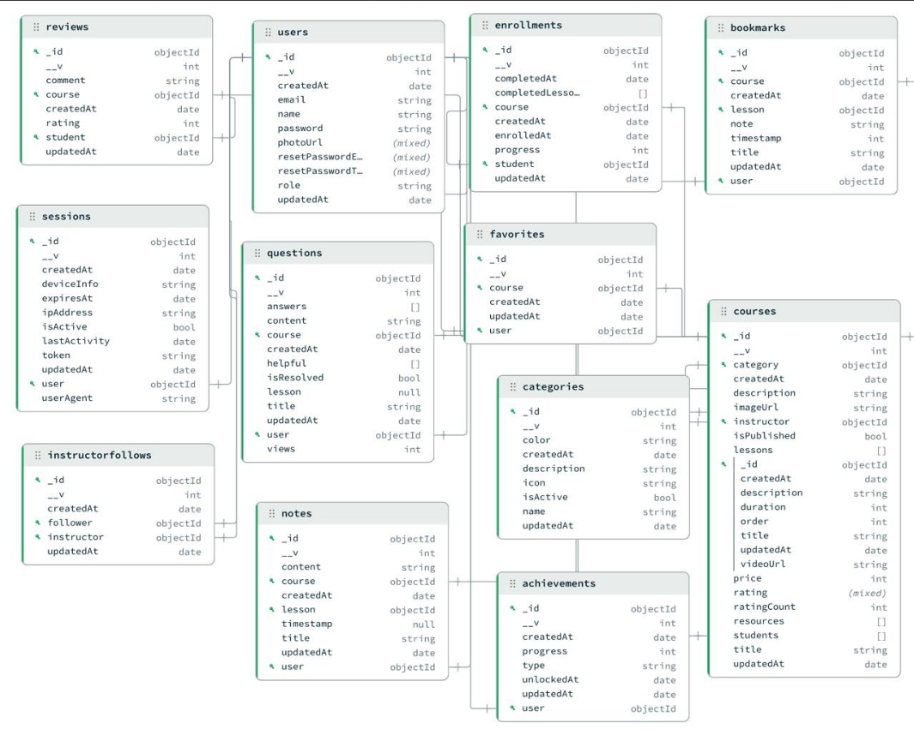

# 🎓 MiniUdemy

MiniUdemy es un proyecto de desarrollo web creado como parte de la materia **Fullstack I (Pila Completa I)**, cuyo objetivo es simular una plataforma de aprendizaje en línea inspirada en Udemy. La aplicación permite a los usuarios explorar cursos, inscribirse, dar seguimiento a su progreso y utilizar funcionalidades interactivas dentro de una interfaz moderna y amigable.

El proyecto está construido bajo la arquitectura **MERN (MongoDB, Express, React y Node.js)**, aplicando buenas prácticas de desarrollo full‑stack y comunicación cliente‑servidor.

---

## 🖼️ Evidencia visual del proyecto

A continuación se muestran algunas imágenes representativas del funcionamiento y la estructura del sistema.

### 📌 Página de inicio

Imagen principal de la interfaz de usuario, donde se muestran los cursos y el acceso general a la plataforma.


### 📌 Estructura de la base de datos

Diagrama de la base de datos en MongoDB, mostrando las colecciones y sus relaciones.



---

## 🚀 Características principales

* Registro e inicio de sesión de usuarios con autenticación JWT
* Gestión de cursos (creación, visualización y categorización)
* Inscripción a cursos y seguimiento de progreso
* Sistema de favoritos y marcadores
* Notas y preguntas por lección
* Sistema de logros (achievements)
* Chatbot con inteligencia artificial para asistencia al usuario
* Arquitectura basada en APIs REST

---

## 🧠 Tecnologías utilizadas

### Frontend

* React
* Axios
* Vite
* CSS

### Backend

* Node.js
* Express
* MongoDB
* Mongoose
* JWT (JSON Web Tokens)

---

## 🔗 Arquitectura del proyecto

El proyecto se divide en dos partes principales:

* **Frontend**: Encargado de la interfaz de usuario y del consumo de las APIs del backend.
* **Backend**: Gestiona la lógica del sistema, la autenticación, las rutas API y la conexión con la base de datos.

Flujo general:

```
Frontend (React)
   ↓
API REST (Express / Node)
   ↓
Base de Datos (MongoDB)
```

---

## ⚙️ Instalación y ejecución

### 1️⃣ Clonar el repositorio

```bash
git clone https://github.com/GabrielElBorre/Proyecto-Mini-Udemy-.git
```

### 2️⃣ Backend

```bash
cd backend
npm install
npm run dev
```

### 3️⃣ Frontend

```bash
cd frontend
npm install
npm run dev
```

---

## 🔐 Autenticación

El sistema utiliza **JWT** para la autenticación y autorización de usuarios, protegiendo las rutas sensibles y manteniendo sesiones seguras.

---

## 🎯 Objetivo del proyecto

MiniUdemy tiene como finalidad reforzar los conocimientos en desarrollo web full‑stack, consumo de APIs REST, diseño de bases de datos NoSQL y aplicación de principios de seguridad y escalabilidad en aplicaciones web modernas.

---

## 👨‍💻 Autor

**Brianna Denisse Medrano Castillo 20130837**
---
**Gabriel Gerardo Cerdenas Briones 21130566**
---
**Juan Raul Wong Aguilar           21130564**

---

## 📄 Licencia

Este proyecto es de uso académico y demostrativo para la materia Pila completa 1.
